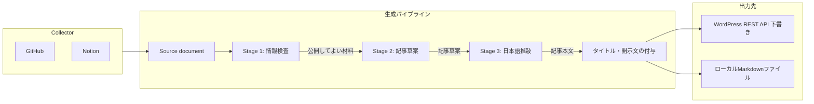

# システムコンセプト

日常的に使うサービスへ自然に残る活動の痕跡を材料として、その期間に何をしていたかを生成AIに記事化させ、AI生成であることを明示してブログへ下書き保存するパイプラインのアーキテクチャ定義である。

## 基本方針

### 活動を淡々と並べる記事

記事の目的は、厳密な活動記録や分析レポートではなく、その期間の活動を淡々と並べることにある。考察、改善提案、有用な知見は積極的に付加しない。多少の解釈誤差は許容するが、公開に適さない個人情報や秘密情報の混入と、日本語として不自然な出力は避ける。

### Source document を生成境界とする

外部サービスから取得した情報は、共通のイベント形式へ正規化せず、Logical Source ごとの Source document としてAIへ渡す。同じサービスから取得した記録でも、実施した作業のログと、後で読むために保存した情報とでは、AIが解釈するときの前提が異なる。Source document はその前提（context）を記録と一緒に運ぶ。

- Service / Collector: GitHub、Notion などの外部サービスから情報を取得する実装単位
- Logical Source: AIにとって同一の意味と前提を共有する記録群
- Source document: Collector が Logical Source ごとに生成し、AIへ渡す Markdown テキスト

### 公開前の情報選別

公開してよい情報の選別は、コードによる収集対象の制限と、AIによる情報検査の二段で行う。コードでは、GitHub の対象リポジトリの allowlist と blacklist、Notion で収集を許可するデータソースを適用する。AIの情報検査では、各 Source の前提に沿って記録を解釈し、個人名、詳細な位置、秘密情報を削除またはぼかし、公開に適さない記録を除外する。生成過程で個々の記録と記事の対応は追跡しない。

### 必須開示文の付与

AIによって生成された記録であること、事実と異なる内容を含む可能性、人間が確認したうえで公開する前提を示す開示文を、コードが最終出力の末尾へ結合する。文面は設定できるが、空にはできない。記事タイトルも対象期間からコードが生成し、AIは本文だけを生成する。

### 下書き連携と同一期間の更新

生成記事はブログプラットフォームへ下書きステータスで保存する。同一期間の識別子（スラッグ）を用いて、再実行時は既存の下書きを更新する。既存記事が公開済みなど下書き以外の状態であれば、人が確認・編集した内容を保護するため更新せず処理を失敗させる。

## アーキテクチャ

### コンポーネント責務

- Collector: 対象期間の記録を取得し、1つ以上の Source document を返す。対象期間に記録がなければ何も返さない。
    - GitHub: ユーザーイベントを取得し、対象リポジトリごとに操作の種類と件数を日付単位で並べる。GitHub 全体を1つの Source document にする。
    - Notion: 許可したデータソースから、対象期間内に作成したページのタイトルと URL を並べる。
- Stage 1（情報検査）: [prompts/inspector.md](../prompts/inspector.md) に基づき、Source document から公開してよい材料を Markdown の箇条書きで出力する。公開してよい材料がなければ空を返し、パイプラインは記事を作らずに終了する。
- Stage 2（記事草案）: [prompts/writer.md](../prompts/writer.md) に基づき、材料から活動を並べた草案を作る。
- Stage 3（日本語推敲）: [prompts/editor.md](../prompts/editor.md) に基づき、草案を常体の自然な日本語に推敲し、記事本文だけを出力する。
- タイトル・開示文の付与: 対象期間から生成したタイトルと、設定の開示文を記事本文に結合する。
- 出力先: 記事をローカルファイルへ書き出し、指定時は WordPress へ下書き保存する。

## データフロー

1. 週次スケジュールまたは手動実行で起動する。
1. 設定されたタイムゾーンと日数・終了日のオフセット、または CLI の明示範囲から対象期間を決める。
1. 各 Collector が Source document を生成する。すべての Collector が何も返さなければ終了する。
1. Stage 1 がすべての Source document を受け取り、公開してよい材料を出力する。材料が空なら終了する。
1. Stage 2 が記事草案を、Stage 3 が記事本文を生成する。
1. タイトルと開示文を結合し、ローカル Markdown ファイルへ書き出す。指定時は WordPress へ下書き登録する。

## 実装構成

- CLI ラッパー: `digest.py` がコマンドライン引数を受け付け、パイプラインを起動する。
- Collector: `activity_digest/collectors/` にサービスごとのモジュールを置く。Source document の型は `activity_digest/collectors/__init__.py` に定める。
- 生成エンジン: `activity_digest/ai.py` が google-genai SDK 経由で3回のリクエストを実行する。プロンプトは `prompts/` 配下のファイルからテンプレート変数を置換して作る。
- パイプライン統括・パブリッシュ: `activity_digest/app.py` が TOML 設定の読み込み、期間計算、記事の組み立て、WordPress REST API（Application Passwords 認証、status=draft 固定）への連携を担う。
- パッケージ・環境管理: uv による非パッケージプロジェクト管理（pyproject.toml、uv.lock、.python-version）。
- 実行基盤: GitHub Actions による共有品質検査と週次実行。
