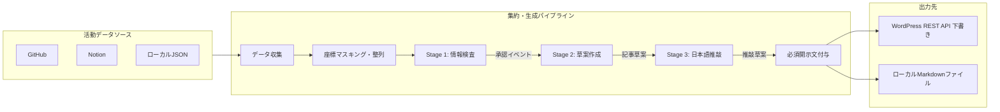

# アーキテクチャと設計方針

日常の活動ログを収集・構造化し、LLM による週次活動日記を生成して WordPress へ保存するパイプラインのアーキテクチャと設計方針を示す。

## 設計方針

### 自動収集とダイジェスト化

日々の開発作業や情報整理ツールから活動記録を収集し、週次のダイジェスト記事として再構成する。ブックマークや既読記事の URL を含むイベントも、通常の活動記録と同様に処理する。対象期間内に活動イベントが存在しない週は、モデルの呼び出しや記事生成を行わずに処理を終了する。

### 必須開示文の付与

記事末尾には必須開示文を結合する。開示文には、AI が生成した記録であること、事実と異なる内容を含む可能性があること、および人間が確認したうえで公開する前提であることを明記する。文面は設定で変更できるが、空値は指定できない。空に設定した場合は、組み込みの既定文が適用される。

### 記事保護と冪等性

生成記事は WordPress REST API 経由で登録する（既定では status=draft）。同一週のスラッグ（識別子）を用い、再実行時は既存の下書きを更新する。公開済みなど下書き以外のステータスを持つ記事がすでに存在する場合は、人間が確認・編集した内容を保護するため、更新を行わずにエラーで処理を終了する。

### 境界での検証

モデルを呼び出す前に、リポジトリの完全一致除外リスト照合、Notion データソースの許可リスト照合、ならびに生座標の粗粒度ラベル変換と文字列マスクを実施する。各生成段階の境界でイベント ID を照合し、モデルによる ID の改変や意図しない追加を遮断する。

### セキュリティ設計

public リポジトリでの運用を前提とし、次のセキュリティ対策を講じる。

- アーティファクト非公開: public リポジトリでは実行ログやアーティファクトが第三者に公開されるため、確認前の生成記事は WordPress の下書きにのみ保存し、GitHub Actions のアーティファクトには保存しない。
- ログ出力の制限: GitHub Actions 上での失敗時は、失敗した段階と例外の型名のみを出力する。API の応答本文、リクエスト URL、スタックトレースを含む詳細はローカル実行時にのみ出力し、ログからの機微情報漏えいを防ぐ。
- 最小権限トークン: ワークフローの `GITHUB_TOKEN` は読み取り権限（contents: read）に限定する。

### 外部連携の制約と運用方針

- GitHub API の取得上限: GitHub のイベント API は直近 300 件までしか取得できない。対象期間内のイベントが 300 件を超える場合、期間前半のイベントが取得漏れとなるため、警告ログを出力する。
- 60 日間非アクティブ停止への対応: public リポジトリでは、コミットなどの活動が 60 日間ないと GitHub がスケジュール実行を自動停止する。API を用いて定期実行を自動延命する手法は公式に保証されておらず、利用規約違反のリスクがあるため採用しない。停止前の警告メールで検知し、手動または GitHub CLI（`gh workflow enable`）で再有効化する運用とする。

## アーキテクチャ

システムの処理フローとコンポーネント構成を次に示す。

### コンポーネントの責務

- 活動データソース: GitHub（ユーザーイベント）、Notion（データソースクエリ）、ローカル JSON から対象期間内のイベントを取得する。
- 座標マスキング・整列: 登録拠点の判定半径に基づく粗粒度ラベル付与、生座標キーの削除、座標文字列のマスク、ならびにタイムスタンプ順の整列を担う。
- Stage 1（情報検査）: 外部プロンプト（`prompts/inspector.md`）に基づき、サニタイズ済みイベントから個人名、詳細な位置、非公開情報を抽象化し、公開に適さないイベントを除外する。イベント ID は入力時の値を保持する。
- Stage 2（草案作成）: 外部プロンプト（`prompts/writer.md`）に基づき、Stage 1 の承認イベントから活動日記の草案を生成する。セクションごとに使用したイベント ID を記録する。
- Stage 3（日本語推敲）: 外部プロンプト（`prompts/editor.md`）に基づき、Stage 2 の草案を入力として常体で文章を推敲する。
- 必須開示文付与: 最終推敲文に対し、AI 生成物である旨、事実と異なる可能性、および人間が公開判断を担う前提を示す定型文を結合する。
- 出力先: 生成した Markdown をローカルファイルへ出力し、指定時は WordPress REST API 経由で下書き保存する。

## データフロー

パイプラインの処理手順を次に示す。

1. 起動と対象期間の確定: 週次スケジュールまたは手動引数に基づき、タイムゾーンとオフセット日数から収集対象期間を確定する。
1. イベント収集: 各データソースからイベントを取得する。対象期間内にイベントが存在しない場合は処理を終了する。
1. サニタイズとマスキング: リポジトリの除外リスト照合、Notion データソースの制限、ならびに生座標のラベル置換とマスク処理を適用する。
1. Stage 1（情報検査）: 公開対象イベントの選定と機微情報の抽象化を行う。
1. 境界検証 1: Stage 1 出力内のイベント ID が入力元に実在すること、および生座標が残存していないことを検証する。
1. Stage 2（草案作成）: 承認イベントから週次ダイジェストの草案を生成する。
1. 境界検証 2: Stage 2 草案が参照するイベント ID が、Stage 1 の承認イベント集合に含まれることを検証する。
1. Stage 3（日本語推敲）: 草案の日本語文章を常体で推敲する。
1. 境界検証 3: Stage 3 推敲草案のイベント ID が、Stage 2 草案と完全に一致することを検証する。
1. 開示文結合: 記事末尾に必須開示文を結合する。
1. 出力と連携: ローカル Markdown ファイルへ保存し、WordPress の下書きを登録または更新する。

## 実装構成

ソースコードのモジュール分割と責務の対応を次に示す。

- CLI エントリポイント（`digest.py`）: コマンドライン引数の受付とパイプラインの起動
- データ収集・サニタイズ（`activity_digest/sources.py`）: GitHub Events API、Notion API（2026-03-11 エンドポイント）、ローカル JSON からのデータ取得、および座標マスキング処理
- 生成エンジン（`activity_digest/ai.py`）: google-genai SDK を用いた 3 段階のモデル呼び出し、Structured Outputs（JSON Schema）による拘束、外部プロンプトの読み込みと境界検証
- パイプライン統括・パブリッシュ（`activity_digest/app.py`）: TOML 設定の読み込み、期間計算、Markdown 生成、WordPress REST API（Application Passwords 認証、status=draft 固定）への連携
- 依存関係管理（`pyproject.toml`, `uv.lock`）: uv による Python パッケージ管理
- CI/CD（`.github/workflows/`）: 共有品質検査ワークフロー（`ci.yml`）および週次実行ワークフロー（`digest.yml`）
