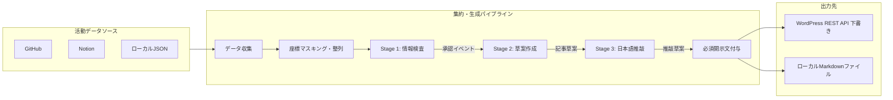

# システムコンセプト

日常の活動ログを収集・構造化し、生成AIによる週次活動日記を作成してブログへ下書き保存するパイプラインのアーキテクチャ定義である。

## 基本方針

### 自動収集とダイジェスト化

日々の開発作業や情報整理ツールから活動記録を収集し、定期的なダイジェスト記事として再構成する。ブックマークや既読記事のURLを含むイベントも通常の活動記録として扱う。

### 必須開示文の付与

AIによって生成された記録であること、事実と異なる内容を含む可能性、人間が確認したうえで公開する前提を示す開示文を最終出力の末尾へ結合する。文面は設定できるが、空にはできない。

### 下書き連携と同一週の更新

生成記事はブログプラットフォームへ下書きステータスで保存する。同一週の識別子（スラッグ）を用いて、再実行時は既存の下書きを更新する。既存記事が公開済みなど下書き以外の状態であれば、人が確認・編集した内容を保護するため更新せず処理を失敗させる。

### 境界での検証

モデル呼び出しの前に、リポジトリの完全一致ブラックリスト照合、Notionデータソースのホワイトリスト照合、生座標の粗粒度ラベル変換と文字列マスクを実施する。各生成段階の境界でイベントIDの照合を行い、モデルによるIDの変更や追加を遮断する。

## アーキテクチャ

システムの処理フローを以下に示す。

### コンポーネント責務

- 活動データソース: GitHub（ユーザーイベント）、Notion（データソースクエリ）、ローカルJSONから対象期間内のイベントを取得する。
- 座標マスキング・整列: 登録拠点の半径判定に基づく粗粒度ラベル付与、生座標キーの削除、座標文字列のマスク、タイムスタンプ順の整列を行う。
- Stage 1（情報検査）: 外部プロンプト（prompts/inspector.md）に基づき、サニタイズ済みイベントから個人名、詳細な位置、非公開情報を除外またはぼかして返す。イベントIDを保持する。
- Stage 2（草案作成）: 外部プロンプト（prompts/writer.md）に基づき、Stage 1の承認イベントから活動を記録する草案を生成する。セクションごとに使用したイベントIDを記録する。
- Stage 3（日本語推敲）: 外部プロンプト（prompts/editor.md）に基づき、Stage 2の草案を入力として常体（だ・である調）での文章推敲を行う。
- 必須開示文付与: 最終推敲文に対し、AI生成であること、事実と異なる内容を含む可能性、公開操作を人間が担うことを示すテキストを結合する。空の設定は組み込み文へ戻す。
- 出力先: 生成されたマークダウンをローカルファイルへ出力し、指定時はWordPressへ下書き保存する。

## データフロー

- 週次スケジュールまたは手動実行による起動。
- 設定されたタイムゾーンと日数・終了日のオフセット、またはCLIの明示範囲に基づく対象期間の確定。
- コレクターによるイベント取得。イベントが存在しない週は処理を終了する。
- リポジトリ名除外、Notionデータソース制限、生座標のラベル置換およびマスク処理。
- Stage 1 による公開対象イベントの選定と承認。
- 境界検証: Stage 1 出力内のイベントIDが入力元に実在することを確認。生座標の残存がないことを検証。
- Stage 2 による週次ダイジェスト草案の生成。
- 境界検証: Stage 2 草案が参照するイベントIDが Stage 1 承認集合に含まれることを確認。
- Stage 3 による日本語文章の推敲。
- 境界検証: Stage 3 推敲草案のイベントIDが Stage 2 草案と同一であることを確認。
- 固定開示文の結合。
- ローカルMarkdownファイルの書き出し、およびWordPress下書き登録（スラッグによる既存記事検索と、下書きの更新または新規作成。下書き以外の既存記事は更新しない）。

## 実装構成

- CLIラッパー: digest.py によるコマンドライン引数の受付とパイプライン起動。
- データ収集・サニタイズ: activity_digest/sources.py による httpx を用いた GitHub Events API、Notion API（2026-03-11 エンドポイント）の呼び出し、ローカルファイル読み込み、座標マスキング処理。
- 生成エンジン: activity_digest/ai.py による google-genai SDK 経由の3回のリクエスト実行。Structured Outputs（JSON Schema）拘束、外部プロンプト（prompts/配下）のテンプレート変数置換、各ステージの境界検証。
- パイプライン統括・パブリッシュ: activity_digest/app.py によるTOML設定ロード、期間計算、Markdown生成、WordPress REST API（Application Passwords認証、status=draft固定）への連携。
- パッケージ・環境管理: uv による非パッケージプロジェクト管理（pyproject.toml, uv.lock, .python-version）。
- 実行基盤: GitHub Actionsによる共有品質検査と週次実行。
